# OS-EX-1-Assembling-the-System---CASE-STUDY

## AIM:

To Assemble the Computer System
## STEPS:

1.Grounding oneself can be done by using an antistatic wrist-strap cable to prevent electrostatic discharge (ESD) which can be deadly to computer electronics. Alternatively, a large metal body like a radiator can also be touched to discharge oneself.

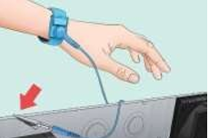

2.To Open the case. Unscrew the side panel (or slide it toward the back of the case) to do so

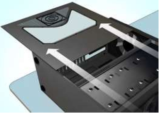

3.Install the power supply. Some cases come with the power supply already installed, while others will require to purchase the power supply separately and install it ourself. Have to make sure that the power supply is installed in the correct orientation,and that nothing is blocking the power supply's fan. a. The power supply will usually go near the top or the bottom rear of the case. Can determine where the power supply is supposed to sit by looking for a missing section on the back of the case.

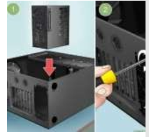

4.Add components to the motherboard. This is usually easiest to do before installing the motherboard, as the case can limit ability towire components:

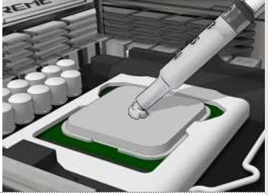

5.Attach the processor to the motherboard by finding the processor port on the motherboard's surface. An indicator on CPU and motherboard will show the correct orientation. b. Attach RAM to the motherboard by finding the RAM slots and inserting the RAM appropriately. c. Attach power supply to the motherboard's power connectors. d. Locate (but do not attach) the motherboard's hard drive SATA port. Can use this to connect the hard drive to the motherboard later.

6.Apply thermal paste to the processor if necessary. Put a small dot (around the size of a grain of rice or a pea) of thermal paste on the CPU. Adding too much thermal paste will create a mess, such as getting paste into the motherboard socket, which may short circuit components and decrease the motherboard's value if planning to sell it later.

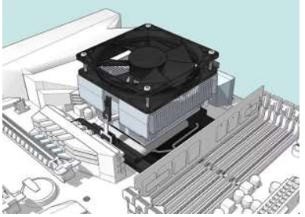

7.Attach the heat sink. This varies from heat sink to heat sink, so read the instructions for the processor. a. Most stock coolers attach directly over the processor and clip into the motherboard. b. Aftermarket heat sinks may have brackets that need to be attached underneath the motherboard. c. Skip this step if processor has an installed heat sink.

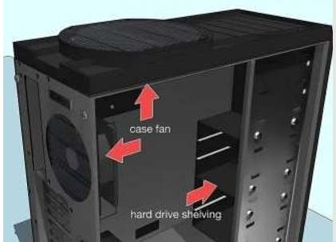

8.Prepare the case needs to knock the plates out of the back of the case in order to fit the components into the correct positions. a. If the case has separate shelving units to hold the hard drive, install the units using the included screws. b. May need to install and wire the case's fans before installing any components. If so, follow the case's fan installation instructions.

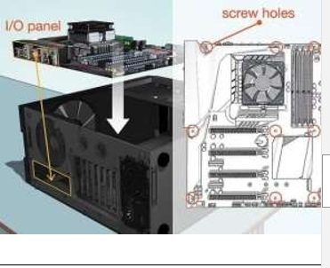

9.Secure the motherboard. Once the standoffs are installed, place the motherboard in the case and push it up against the backplate. All of the back ports should fit into the holes in the I/O backplate. a. Use the screws provided to secure the motherboard to the standoffs through the shielded screw holes on the motherboard.

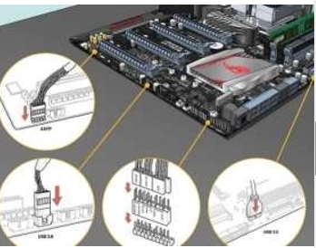

10.Plug in the case connectors. These tend to be located together on the motherboard near the front of the case. The order in which these are connected will depend on which is easiest. Make sure that the USB ports are connected, the Power and Reset switches, the LED power and hard drive lights, and the audiocable. The motherboard’s documentation will show where on the motherboard these connectors attach. a. There is typically only one way that these connectors can attach to the motherboard. Do not try to force anything to fit.

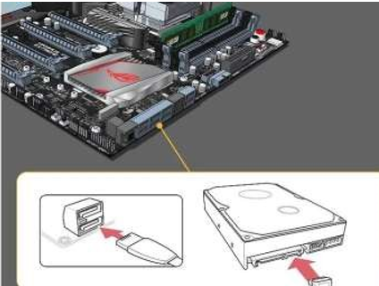

11.Install the hard drive. This process will vary slightly depending on your case, but should typically go as follows: a. Remove any front panels on the case. b. Insert the hard drive into its slot (usually near the top of the case). c. Tighten any screws needed to hold the drive-in place. d. Plug the hard drive's SATA cable into the SATA slot on the motherboard.

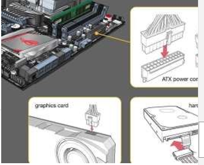

12.Connect the power supply to any necessary components. If the power supply is not connected to components which need power, make sure that it is connected to the following locations: a. Motherboard b. Graphics card(s) c. Hard drive(s)

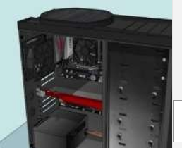

13.Finish the computer assembly. Once placed and connected the various internal components for the computer, all that's left to do is ensure that none of the wires interfere with circulation and close up the case. a. If bought a cooling system, install it before proceeding. Refer to the cooling system's installation instructions in order to do so. b. Many cases will have a panel which either slides back into place or screws onto the side of the case.

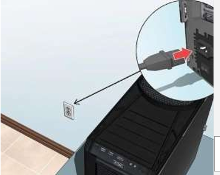
 
## RUNNING THE COMPUTER:

1.Attach the computer to an outlet. Using the power source's power cable, plug the computer into a wall outlet or power strip. a. May first have to attach the electrical cable to the power source input on the back of the computer's case.

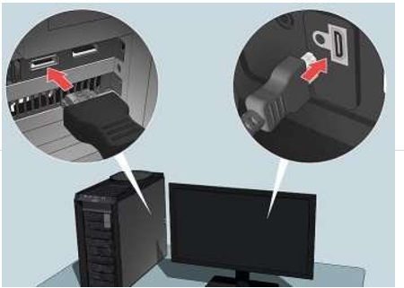

2.Plug a monitor into the computer. Typically use the graphics card output that is near the bottom of the case, though some motherboards may have this port on the right or left side ofthe case. a. The output here is usually a DisplayPort or HDMI port.

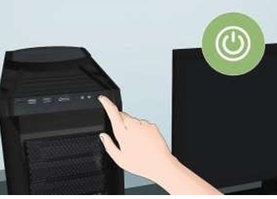

3.Turn on the computer. Press the computer's Power button on the front or back of the case. If everything's properly connected, the computer should start up.

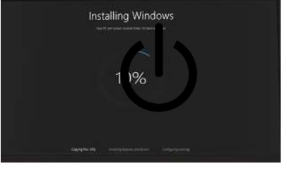

4.Install Windows or Linux. Windows is compatible with all PCs and will make full use of their various features (e.g., Bluetooth), but will have to purchase a copy of Windows if not having a product key. Linux is free but may not be able to use all the computer's hardware. a. If not having an installation USB drive, need to create one on another computer before can install the operating system.

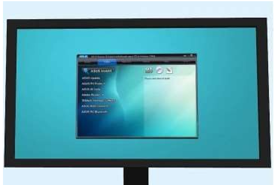

5.Install the drivers. Once the operating system is installed, need to install the drivers. Almost all the hardware that was purchased should come with discs that contain the driver software needed for the hardware to work. • Modern versions of Windows and Linux will install most drivers automatically when connected to the Internet.

## Result :

The Computer System has been successfully assembled. 